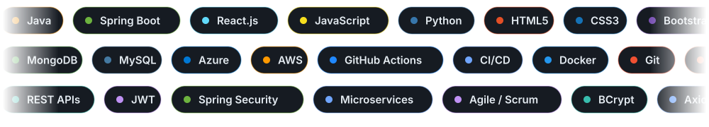
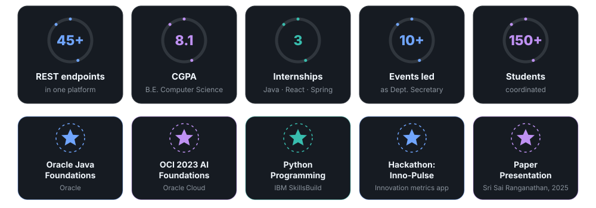
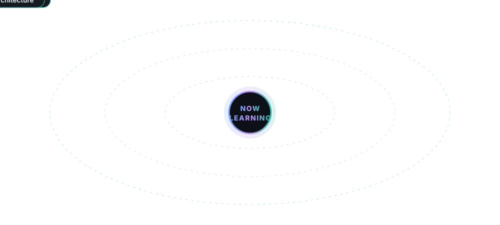
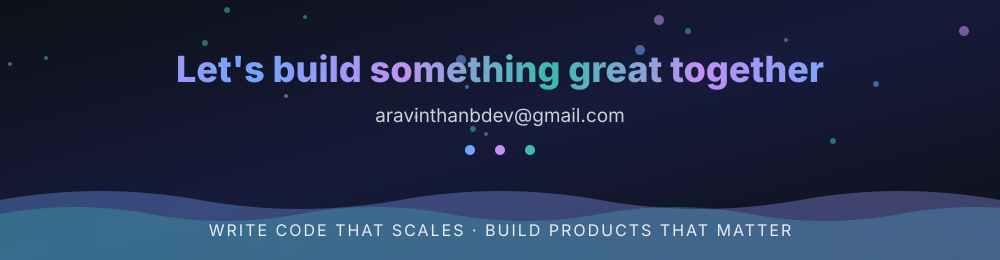

  

<table>
<tr>
<td></td>
<td></td>
<td></td>
</tr>
</table>

Also: Full Stack Development Workshop (Novi Tech R&D Pvt. Ltd.) · Department Secretary at EASA College

<picture>
  <source media="(prefers-color-scheme: dark)" srcset="https://raw.githubusercontent.com/Aravinthanbdev/Aravinthanbdev/output/github-snake-dark.svg"/>
  <source media="(prefers-color-scheme: light)" srcset="https://raw.githubusercontent.com/Aravinthanbdev/Aravinthanbdev/output/github-snake.svg"/>
  
</picture>

